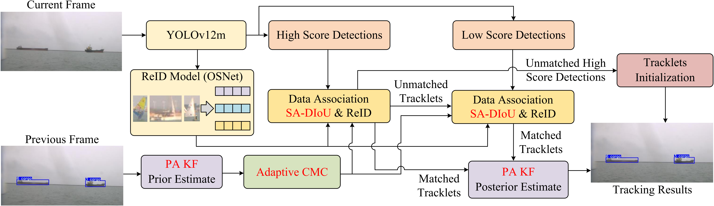
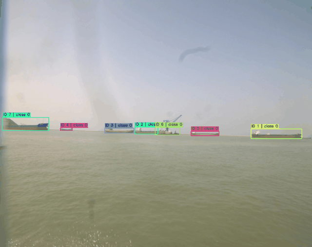
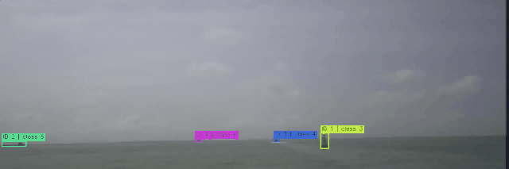
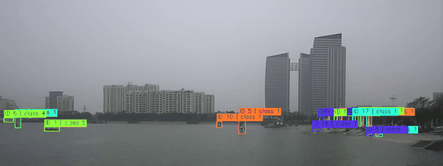

# Sea-SORT

> **Note:** The complete code will be made publicly available upon acceptance of the paper.

#### Sea-SORT: Multi-Object Tracking in Maritime Scenes with Camera Shake and Low-Texture Backgrounds

## Method Overview

Fig. 1: Overall framework of Sea-SORT. YOLOv12m is used for object detection, and OSNet extracts appearance features. Sea-SORT adopts a two-stage association strategy, where PA KF predicts trajectories and Adaptive CMC refines prior position estimates before updating the track states. The proposed components are highlighted in red.

## Tracking performance

### Results on USVMaritime-24k test dataset

| Method          | HOTA ↑ | IDF1 ↑ | AssA ↑ |
| :-------------- | :----: | :----: | :----: |
| BoT-SORT        |  41.5  |  45.2  |  41.5  |
| Hybrid-SORT     |  42.6  |  48.3  |  44.5  |
| MotionTrack     |  42.9  |  49.3  |  45.7  |
| Sea-SORT (Ours) |  46.1  |  53.9  |  49.4  |

### Results on JMT-2022 test dataset

| Method              |   HOTA ↑    |   IDF1 ↑    |   AssA ↑    |
| :------------------ | :---------: | :---------: | :---------: |
| BoT-SORT            |    35.5     |    39.0     |    32.0     |
| Hybrid-SORT         |    35.6     |    39.5     |    35.6     |
| MotionTrack         |    37.9     |    44.6     |    37.9     |
| Sea-SORT (Ours)     |    40.6     |    47.1     |    41.9     |

### Results on SMD dataset

For SMD, we select three onboard sequences that exhibit pronounced camera shake: MVI_0797_VIS_OB, MVI_0799_VIS_OB, and MVI_0801_VIS_OB.

| Method       |   HOTA ↑    |   IDF1 ↑    |   AssA ↑    |
| :----------- | :---------: | :---------: | :---------: |
| BoT-SORT     |    59.4     |    75.1     |    71.1     |
| Hybrid-SORT  |    57.2     |    71.7     |    66.6     |
| MotionTrack  |    55.7     |    66.3     |    61.8     |
| Sea-SORT     |    60.0     |    75.7     |    72.8     |

### Results on USVTrack test dataset

| Method       |   HOTA ↑    |   IDF1 ↑    |   AssA ↑    |
| :----------- | :---------: | :---------: | :---------: |
| BoT-SORT     |    46.6     |    51.0     |    71.2     |
| Hybrid-SORT  |    44.8     |    48.4     |    68.0     |
| MotionTrack  |    46.4     |    51.2     |    71.2     |
| Sea-SORT     |    46.8     |    51.3     |    71.0     |

## Data preparation

We evaluate Sea-SORT on four maritime tracking datasets. The publicly available datasets can be downloaded from their official sources below.

### 1. USVMaritime-24k 

USVMaritime-24k is an in-house dataset and is not publicly available due to privacy considerations.

### 2. JMT-2022

JMT-2022 can be downloaded from its official GitHub repository:

[hjq3659/Jari-Maritime-Tracking-2022: 杰瑞杯海面目标检测与跟踪竞赛数据集JMT2022](https://github.com/hjq3659/Jari-Maritime-Tracking-2022)

### 3. SMD

The Singapore Maritime Dataset (SMD) can be downloaded from its official project page:

[dilipprasad - Singapore Maritime Dataset](https://sites.google.com/site/dilipprasad/home/singapore-maritime-dataset)

### 4. USVTrack

USVTrack can be downloaded from its official GitHub repository:

[USVTrack/USVTrack: Official repository for USVTrack dataset](https://github.com/USVTrack/USVTrack)

## Model zoo

### 1. ReID models weight

An OSNet-x1.0 model was trained separately for each dataset using the official [TorchreID](https://github.com/KaiyangZhou/deep-person-reid) library. The resulting ReID model weights can be downloaded below.

JMT-2022：https://drive.google.com/file/d/1TH2-4CHs5fJuOc6duigMZx4ukmnFj2Kw/view?usp=drive_link

SMD：https://drive.google.com/file/d/1fAJuFonJamG_XwIDoEkIxaWxL4sdAw4L/view?usp=drive_link

USVTrack：https://drive.google.com/file/d/1KC16YNN7HzUQ5luuOWO_NolI6zO-9rW0/view?usp=drive_link

### 2. YOLOv12 Weight

YOLOv12m was used as the unified object detector for all evaluations. To accommodate the characteristics of each dataset, the input resolution was set to 1280 × 1280 for USVMaritime-24k and JMT-2022, 1024 × 1024 for SMD, and 1440 × 1440 for USVTrack. Each model was trained for 100 epochs with a batch size of 4 using the stochastic gradient descent (SGD) optimizer. The initial learning rate, momentum, and weight decay were set to 0.01, 0.937, and 0.0005, respectively. During inference, the confidence and IoU thresholds for non-maximum suppression (NMS) were set to 0.1 and 0.6, respectively. The resulting detector weights can be downloaded below.

JMT-2022：https://drive.google.com/file/d/1-8VObX-OkRS-rjGTllgeCk3ZdhmVjqBS/view?usp=drive_link

SMD：https://drive.google.com/file/d/17lpBef9lkVUnM5T3VHDFIz-K_4I0RD0f/view?usp=drive_link

USVTrack：https://drive.google.com/file/d/1yn_AQD7hXzADIHQLUxdV5M_DRaE3sT2W/view?usp=drive_link

## Visualization results

### 1. USVMaritime-24k 

  
  
  

### 2. JMT-2022

  
  
  

